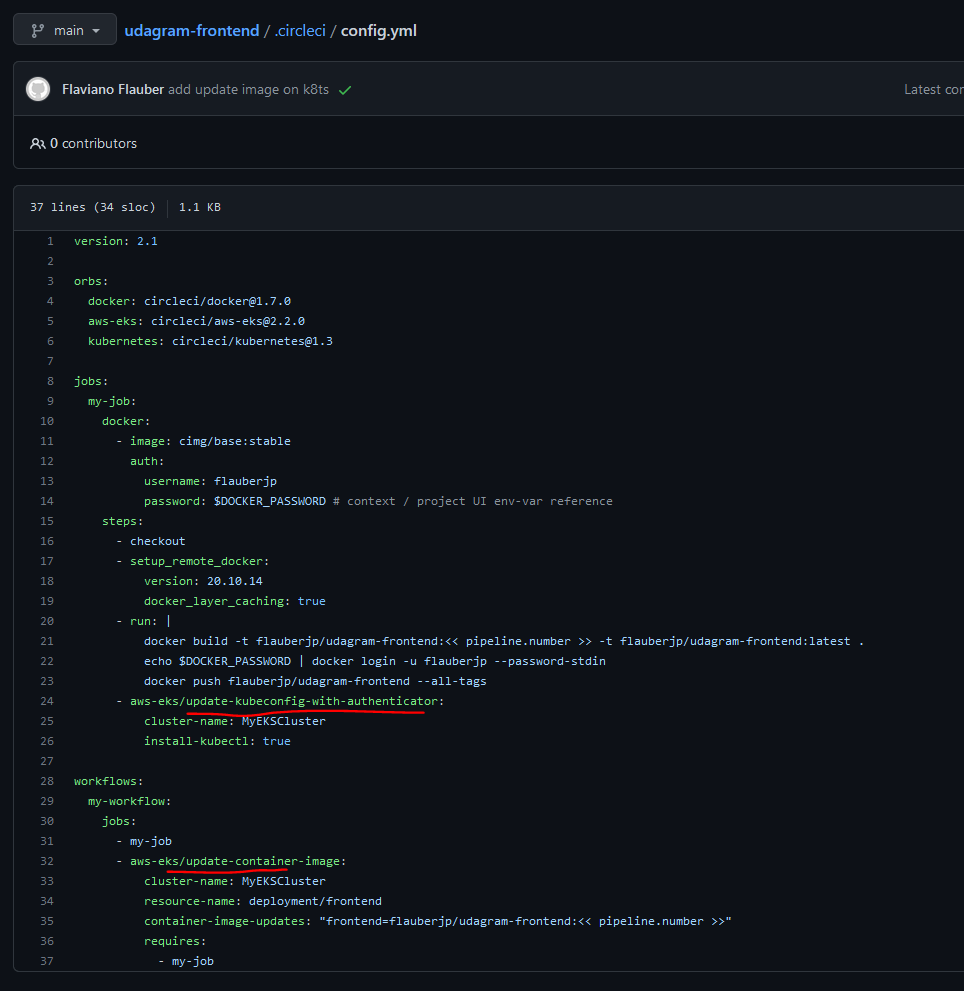
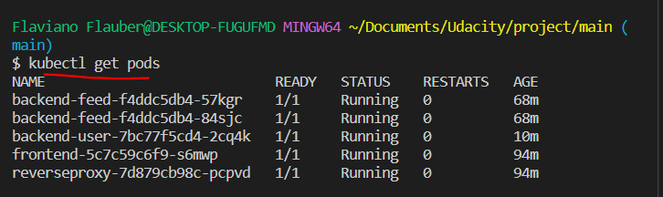
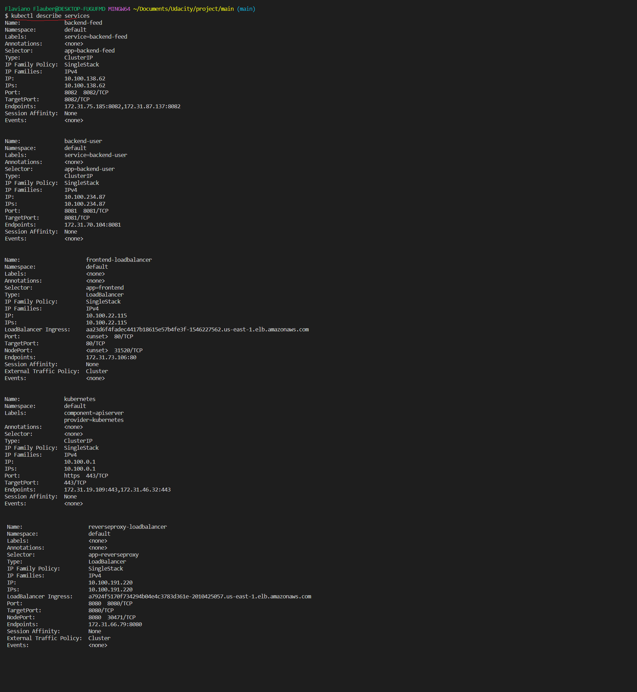

# Screenshots

To help review your infrastructure, please include the following screenshots in this directory::

## Deployment Pipeline

- DockerHub showing containers that you have pushed
  - Dockerhub listing images for each created microservice: _flauberjp/udagram-frontend_, _flauberjp/udragram-reverseproxy_, _flauberjp/udagram-api-feed_, and _flauberjp/udagram-api-user_
    
- GitHub repository’s settings showing your Travis webhook (can be found in Settings - Webhook)

  - reverseproxy
    - circleci webhook
      
    - circleci config file
      
  - udagram-api-feed
    - circleci webhook
      
    - circleci config file
      
  - udagram-api-user
    - circleci webhook
      
    - circleci config file
      
  - udagram-frontend
    - circleci webhook
      
    - circleci config file
      

- Travis CI showing a successful build and deploy job
  - Circle CI pipelines for all 4 repositories
    

## Kubernetes

- To verify Kubernetes pods are deployed properly
  
- To verify Kubernetes services are properly set up
  

- To verify that you have horizontal scaling set against CPU usage
  

- To verify that you have set up logging with a backend application
  - Customer submitted a request, which CorrelationId was eb31f9b1-b379-494b-9359-9f129b4be06b, what could identify him. It was send as part of the haders from a request from the browser.
    - In the image below, you see that in the request header we inserted a correlation id.
      
    - In the image below, we have the logs of the pod that handled the request, and by doing it a log printing the correlation id was printed as log.
      
